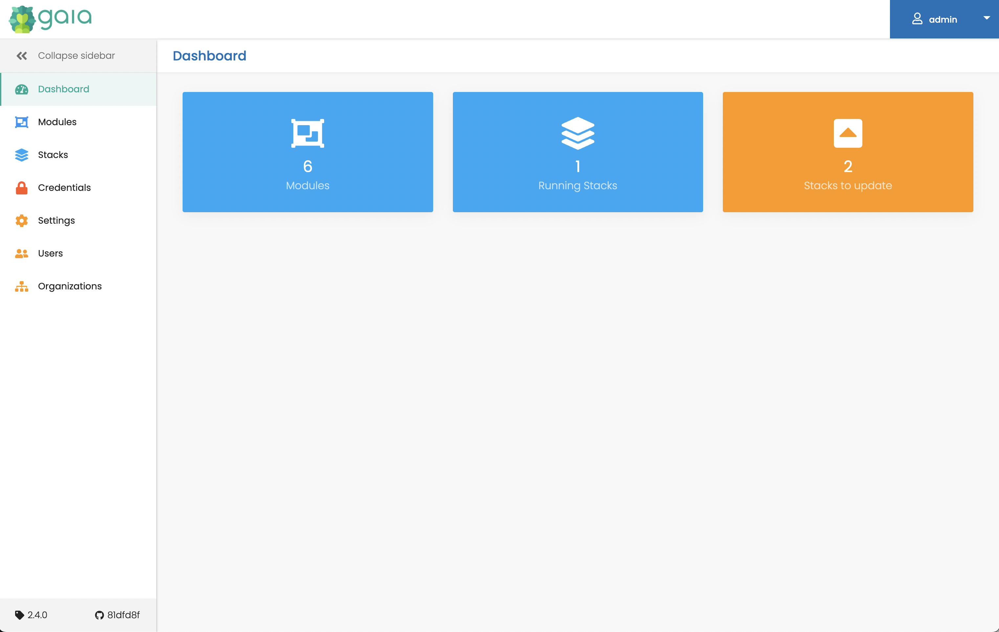

# 졸업과제 

* terraform ui 를 통한 가시화 도전 해보기 

다른 블로그를 보니까 terraform 을 사용하는 과정에서 ui 출럭을 통한 가시화 및 
변경 점에 대한 infracost 라는 프로젝트들을 자동화 과정에 포함되어있는것들을 보았다. 

사실 terraform cloud 를 쓰거나 atlantis, scalr 를 사용하면 해소 될 문제이긴 하지만 
온 프레미스 아무것도 없는 환경에서는 처음부터 구축 할 수도 있을거 같다는 생각에 가시화에 도전해보려한다. 

### 가시화 프로젝트의 종류 

종류야 프로젝트가 추가 되면 다양하게 있을 수 있지만 2가지를 확인 해보려고 한다. 

Gaia 와 pluralith 

* https://docs.gaia-app.io/
* https://www.pluralith.com/

### gaia 설치 

* gaia 는 docker-compose 의 설치 환경을 제공 해준다. 

```sh 
git clone git@github.com:gaia-app/gaia.git
cd gaia
docker-compose up -d

❯ docker ps
CONTAINER ID   IMAGE     COMMAND                  CREATED          STATUS          PORTS                    NAMES
a7be2faf18f3   gaia-db   "docker-entrypoint.s…"   11 minutes ago   Up 11 minutes   27017/tcp                gaia-mongo-1
b9bf158efb0b   gaia      "java -jar gaia.jar"     11 minutes ago   Up 11 minutes   0.0.0.0:8080->8080/tcp   gaia-gaia-1
```

### gaia 를 통한 배포 

* gaia 는 stack 라는 배포 단위를 가지고 있으며 stack 에는 terraform module 를 포함한다. 
* 즉 terraform registry 를 module 단위로 import 할 수 있다. subdir 이여도 말이다. 
* 그리고 모듈을 배포 하면 stack 라는 단위로 관리 하게 된다. 
* stack 는 variable 를 등록 한 후에 실행 하게 된다면 job 이라는 객체로 실행 이력을 관리한다. 


* 실행 결과 
  * 생각보다 불만족스러움 
  * docker-mongo 는 잘 배포 되는것을 확인 
  * UI 상의 오류가 많이 발생 되는것을 확인 가능 
  * job 이 출력 안된다던지. 실행 후 확인할 메뉴텝이 없다던지 
    * 초기 stack 를 생성 하면 아무것도 안하는 job 이 생성됨.. 뭐지? 하는 느낌이 있음
  * 어떤게 잘못되어서 실행이 안된다던지 이런것을 확인하기에는 전무함..
  * 자동화 관련 RestAPI 지원이 없다는 점도 아쉬움 


* Dashboard 화면 


* Module 화면 


* Module 화면 > module import 


* Module 화면 > module import > edit


* Stack 화면 


* Stack 화면 > 상세


* Stack 화면 > 상세 > jobs


* Stack 화면 > 상세 > jobs : docker-mongo 의 실행 예시


### pluralith

* 해당 제품은 SaaS 제품으로 보이며 로컬에서 실행 할 수 있는 옵션이 있다. 
* Run in CI 의 모드로 실행 할 경우에 pluralith 명령어를 통하여 
  * init, plan, apply & destroy 를 실행할수 있으며
  * terraform command 를 wrap 해준다고 한다. 
  * 실행한 결과물은 Saas 인 Dashboard 에서 확인 할 수 있다고 한다. 
  * 결과물은 AWS infra diagram, cost 관련 정보 들이 있다고 한다. 

* Run in Locally 로 실행 해본다. 
  * 1주차 과제로 퀵하게 돌려보자 

* 설치는 어렵지 않고 다운로드 하면 끝이다. 
  * https://docs.pluralith.com/docs/get-started/run-locally

* diagram 확인도 plan 명령을 실행 하면 바로 실행 된다. 
```sh 
pluralith plan
pluralith apply
pluralith destoy
```

* terraform-study week 1 과제 예시


* infra cost 화면 아쉽게도 계산은 못하는듯?


* apply 명령시 : 변경중인 인프라는 사선으로 에니메이션 효과가 있다. 극호감


* apply > event list


* ec2 리소스 변경후 출력 : m5.xlarge -> m5.2xlarge 


* 변경후 infra cost 역시 계산 못하고 있음 


* 세세하게 모든 기능을 등록해서 테스트 해보지는 않았지만 ui 가 위의 기능을 포함하고 어떠한 것들을 수행한다 라는것들은 볼수 있다. 
* ui 는 좋다고 생각하나 saas 로 dashboard 에서 확인 해야하면 ci 상에서 url 정보를 결과에 잘 전달 해주어야하는데 local 이라 안보이는건지 모르겠다. 
* infra cost 계산은 못하고 있는것으로 보이고 나머지 세세한 기능들도 아직 안되는것으로 보여서 조금 기다렸다 사용해보아야 할거 같다.
